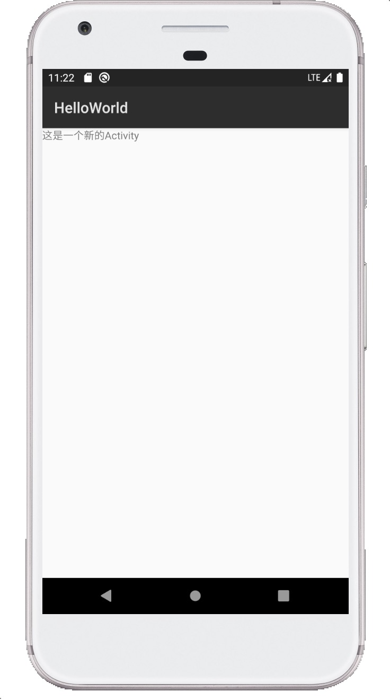

## Cordova 调用android原生Activity
````
  特别注意 android 项目的包名 必须为 com.example.hello，否则编译不会通过。
  
````
### 1.准备一个创建好的插件
[Cordova 自定义插件](https://blog.csdn.net/m0_37609394/article/details/84873861)

文件结构
````
cordova-plugin-activity
     |-- src // 平台源码
         |-- android // Android 平台源码
             |-- activity // activity java 代码
                  |-- FirstActivity.java //要新增加java代码
             |-- layout // activity layout 布局代码
                  |-- activity_first.xml //要新新增的xml
             |-- FirstPlugin.java // 插件 主类
     |-- www // 调用原生的js代码 
     |-- package.json // 
     |-- plugin.xml // 插件配置文件  

````

### 2.创建一个 FirstActivity.java 
````
package cordova.plugin.first.plugin.activity;

import android.app.Activity;
import android.os.Bundle;

import com.example.hello.R;

public class FirstActivity extends Activity {

    @Override
    protected void onCreate(Bundle savedInstanceState) {
        super.onCreate(savedInstanceState);
        setContentView(R.layout.activity_first);
    }
}

````
### 3.创建一个 activity_first.xml
```` 
<?xml version="1.0" encoding="utf-8"?>
<LinearLayout
        xmlns:android="http://schemas.android.com/apk/res/android"
        xmlns:tools="http://schemas.android.com/tools"
        android:layout_width="match_parent"
        android:layout_height="match_parent"
        android:orientation="vertical"
        tools:context="cordova.plugin.first.plugin.activity.FirstActivity">

    <TextView
            android:id="@+id/textView"
            android:layout_width="wrap_content"
            android:layout_height="wrap_content"
            android:text="这是一个新的Activity"
            tools:layout_editor_absoluteX="152dp"
            tools:layout_editor_absoluteY="180dp"
            tools:ignore="MissingConstraints" />

</LinearLayout>

````
### 4.修改 plugin.xml 

````
<?xml version='1.0' encoding='utf-8'?>
<plugin id="cordova-plugin-activity" version="1.0.0" xmlns="http://apache.org/cordova/ns/plugins/1.0"
        xmlns:android="http://schemas.android.com/apk/res/android">
    <name>FirstPlugin</name>
    <js-module name="FirstPlugin" src="www/FirstPlugin.js">
        <clobbers target="FirstPlugin"/>
    </js-module>
    <platform name="android">
        <config-file parent="/*" target="res/xml/config.xml">
            <feature name="FirstPlugin">
                <param name="android-package" value="cordova.plugin.first.plugin.FirstPlugin"/>
            </feature>
        </config-file>
        <!--新增代码1 start-->
        <config-file target="AndroidManifest.xml" parent="/manifest/application">
            <activity android:name="cordova.plugin.first.plugin.activity.FirstActivity"></activity>
        </config-file>
        <!--新增代码1 end -->
        <config-file parent="/*" target="AndroidManifest.xml"></config-file>
        <source-file src="src/android/FirstPlugin.java" target-dir="src/cordova/plugin/first/plugin"/>
        <!--新增代码2 start-->
        <source-file src="src/android/activity/FirstActivity.java" target-dir="src/cordova/plugin/first/plugin/activity"/>
        <resource-file src="src/android/layout/activity_first.xml" target="res/layout/activity_first.xml"/>
        <!--新增代码2 end -->

    </platform>
</plugin>

````
### 5.添加插件
````
 // 到基于cordova的项目中，输入以下命令
 cordova plugin add [插件路径]
 // 也可以安装我的示例插件
 cordova plugin add https://github.com/waliu/cordova-plugin-study/tree/master/cordova-plugin-activity
````

### 6. 调用示例
#### js调用示例
````
        try {
            // console.log(window.FirstPlugin);
            window.FirstPlugin.testFirstPlugin((res)=>{
                console.log(res);
            },(error)=>{

            },null);
        } catch (e) {
            console.log(e);
            console.log("请在真机或者模拟器运行");
        }
````
#### typescript/ionic2 +调用示例
````
        try {
            // console.log(window.FirstPlugin);
            (<any>window).FirstPlugin.testFirstPlugin((res)=>{
                console.log(res);
            },(error)=>{

            },null);
        } catch (e) {
            console.log(e);
            console.log("请在真机或者模拟器运行");
        }
````
### 7.插件最终效果


### 8.插件源码

[js调用源码](./example) 

[插件源码](../cordova-plugin-activity)

### 联系我:QQ群 390736068
