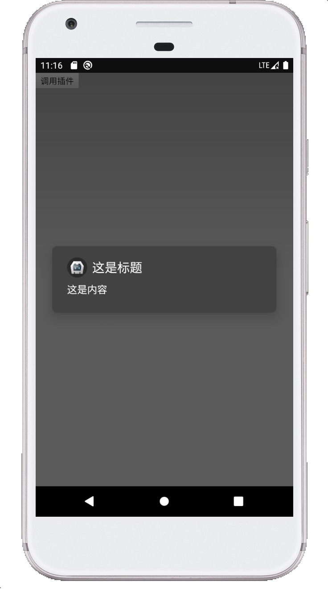

## Cordova 自定义插件(android)
````
  特别注意 android 项目的包名 必须为 com.example.hello，否则编译不会通过。
  
````
### 1.安装命令工具
````
$ npm i plugman -g
mac 电脑：$ sudo npmi plugman -g)
````
### 2.创建第一个插件
````
 $plugman create --name FirstPlugin --plugin_id cordova-plugin-first-plugin --plugin_version 1.0.0

````
### 3.添加Android插件
````
 $plugman platform add --platform_name android  
 注：平台有 android、ios、windows
 
 将 FirstPlugin 文件 改为 cordova-plugin-first-plugin

 改后的文件结构

 cordova-plugin-first-plugin
     |-- src // 平台源码
         |-- android // Android 平台源码
     |-- www // 调用原生的js代码 
     |-- package.json // 
     |-- plugin.xml // 插件配置文件   
  
````

### 5.将 FirstPlugin.js 修改为

````
var exec = require('cordova/exec');

var FirstPlugin = {
    testFirstPlugin: (arg0, success, error) => {
        exec(success, error, 'FirstPlugin', 'testFirstPlugin', [arg0]);
    }
}
module.exports = FirstPlugin;


````

### 6.将 plugin.xml 修改为

````

<?xml version='1.0' encoding='utf-8'?>
<plugin id="cordova-plugin-first-plugin" version="1.0.0" xmlns="http://apache.org/cordova/ns/plugins/1.0"
        xmlns:android="http://schemas.android.com/apk/res/android">
    <name>FirstPlugin</name>
    <js-module name="FirstPlugin" src="www/FirstPlugin.js">
        <clobbers target="FirstPlugin"/>
    </js-module>
    <platform name="android">
        <config-file parent="/*" target="res/xml/config.xml">
            <feature name="FirstPlugin">
                <param name="android-package" value="cordova.plugin.first.plugin.FirstPlugin"/>
            </feature>
        </config-file>
        <config-file parent="/*" target="AndroidManifest.xml"></config-file>
        <source-file src="src/android/FirstPlugin.java" target-dir="src/cordova/plugin/first/plugin"/>
    </platform>
</plugin>

````

### 7.添加package.json 文件

````
 plugman createpackagejson [插件路径]

````

### 8.添加插件
````
 到基于cordova的项目中，输入以下命令
 cordova plugin add [插件路径]
````
### 9.调试插件
````
用Android sudio 打开cordova 项目。

````
[android Studio打开项目](https://blog.csdn.net/m0_37609394/article/details/83377509)

debug 启动就能调试插件

### 10. 将 FirstPlugin.java 改为
```
 package cordova.plugin.first.plugin;
 
 import android.app.AlertDialog;
 
 import com.example.hello.R;
 
 import org.apache.cordova.CordovaPlugin;
 import org.apache.cordova.CallbackContext;
 
 import org.json.JSONArray;
 import org.json.JSONException;
 import org.json.JSONObject;
 
 /**
  * This class echoes a string called from JavaScript.
  */
 public class FirstPlugin extends CordovaPlugin {
 
     @Override
     public boolean execute(String action, JSONArray args, CallbackContext callbackContext) throws JSONException {
         if (action.equals("testFirstPlugin")) {
             String message = args.getString(0);
             this.testFirstPlugin(message, callbackContext);
             return true;
         }
         return false;
     }
 
     private void testFirstPlugin(String message, CallbackContext callbackContext) {
         if (message != null && message.length() > 0) {
             AlertDialog alertDialog = new AlertDialog.Builder(cordova.getContext())
                     .setTitle("这是标题")//标题
                     .setMessage("这是内容")//内容
                     .setIcon(R.mipmap.ic_launcher)//图标
                     .create();
             alertDialog.show();
             callbackContext.success(message);
         } else {
             callbackContext.error("Expected one non-empty string argument.");
         }
     }
 }

```


### 11. 调用示例
#### js调用示例
````
        try {
            // console.log(window.FirstPlugin);
            window.FirstPlugin.testFirstPlugin((res)=>{
                console.log(res);
            },(error)=>{

            },null);
        } catch (e) {
            console.log(e);
            console.log("请在真机或者模拟器运行");
        }
````
#### typescript/ionic2+ 调用示例
````
        try {
            // console.log(window.FirstPlugin);
            (<any>window).FirstPlugin.testFirstPlugin((res)=>{
                console.log(res);
            },(error)=>{

            },null);
        } catch (e) {
            console.log(e);
            console.log("请在真机或者模拟器运行");
        }
````
### 12.插件最终效果


#### 13.资源下载

[js调用源码](./example) 

[插件源码](../cordova-plugin-first-plugin) 

[测试apk下载](../cordova-plugin-activity/apk) 

### 14.如何调用一个原生的提示弹窗

[android 原生弹窗博客](https://blog.csdn.net/qq_35698774/article/details/79779238)

### 联系我:QQ群 390736068


